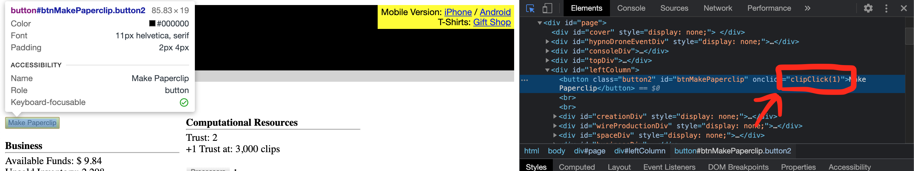
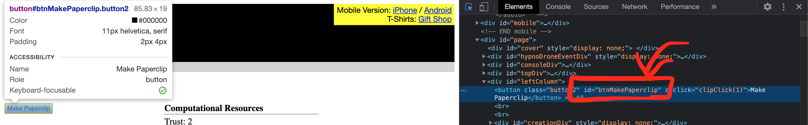

# WARNING: libcheat on its own will not cause any problem. However if you're using it in conjunction with the code of someone with malicious intent it would be a security flaw. Please make sure you know what it is you're doing before using it.

# libcheat / extcheat

- [Introduction](#Introduction)
- [How to automate tasks](#How-to-automate-tasks)
- [Documentation](#Documentation)
	- [task](#task)
	- [toggleable](#toggleable)
	- [button](#button)
	- [watch](#watch)
	- [parametric](#parametric)
	- [slowdown](#slowdown)
- [extcheat](#extcheat)

## Introduction

libcheat is a library you can import in your console to help play (cheat) html games.

It does require knowledge of programming and html to use efficiently. However it was built in such a way that it's easy to share your cheats with others.

It is recommended you use extcheat as it aleviates some of the tedious aspect of using libcheat but libcheat is is available directly.

The core idea of libcheat is to import a utility script in the game to help automate some tasks (or outright cheat).

The first line of your cheat script will often be the following:

	let { libcheat } = await import('https://hydroflame.github.io/libcheat/lib/latest/main.js');

This will import libcheat latest version, you can also import older versions by replacing `latest` with whatever version you like.

Importing this will automatically a UI that helps control your cheats.

The main gimmick is that this auto sets up a scheduler every 50 ms (not configurable) that will run all your tasks.

We will take [universal paperclip](https://www.decisionproblem.com/paperclips/index2.html) as an example:

Let's say we want to press the "Make paperclip" button.

	libcheat.task(() => clipClick(1));

This will click the button every 50ms.

That's great but you may want to be able to disable this sometimes. We will use `toggleable` instead.

	libcheat.toggleable(() => clipClick(1), 'make paperclip');

That will add a checkbox on the ui with the label `make paperclip`. When that checkbox is checked the task will be executed.

Now we want to setup a skill tree in [calculator evolution](https://spotky1004.com/Calculator-Evolution/). We know we need to buy 5 skills for this one.

This isn't a task we want executed every 50ms. Only when we click it. So we can use `button`

	libcheat.button(() => {
		buyQuantumUpgrade(5);
		buyQuantumUpgrade(2);
		buyQuantumUpgrade(3);
	}, 'setup skill tree');

This adds a button on the cheat ui, when clicked that function is executed.

Now I want to automatically ascend for 1e5x more resources than I had before (in an unnamed game). But not always exactly 1e5, sometimes more or sometimes less. So I want a field that I can change.

	libcheat.parametric(v => {
		if(game.points.mul(v) < calcAscensionGain()) ascend();
	}, 'auto ascension');

This will add a label and a field on the UI, the first argument of the function is the value of the field. (be careful about validating that value.

Finally sometimes we just want to be able to see a value that isn't exposed to the user. We can use `watch`

	libcheat.watch(() => {
		return "ascend for: " + calcAscensionGain();
	});

This one is special because it's the only one that returns a value.

Here's an example of a starter script for [universal paperclip](https://www.decisionproblem.com/paperclips/index2.html):

	let { libcheat } = await import('https://hydroflame.github.io/libcheat/lib/latest/main.js');

	// Always make paperclips.
	libcheat.task(()=>clipClick(1));

	// Toggleable task to automatically buy wire when we have none.
	libcheat.toggleable(() => {
		if(wire < 1) buyWire();
	}, 'smart buy wire');

	// Toggleable task to automatically buy clippers.
	libcheat.toggleable(makeClipper, 'auto buy clipper');

	// This is an actual cheat, you should not be able to get 1000 free wire.
	libcheat.button(() => {
		wire += 10000;
	}, 'add 1e4 wire');

## How to automate tasks

There are several ways that you can gain access to the necessary code or
elements required to automate your tasks.

We will make heavy use of the inspect tool in this section. You should know how
to use it before moving on.

The first one is simple, sometimes the javascript function that is called when a
button is pressed is directly available.

From this we know when that button is called the javascript `clipClick(1)` is
executed and so we can add the following line to our script.

	libcheat.task(() => clipClick(1));

or

	libcheat.toggleable(() => clipClick(1), 'make paperclips');

When the js isn't available you may be able to refer to an element by it'd html id. Like this.

We could add the following line to our script and have the same effect.

	libcheat.task(() => document.getElementById('btnMakePaperclip').click());

For more complex element selection see `querySelector` or `getElementsByClassName`.

## Documentation

### task(f)
Add a task to the schedule executed every frame.
#### f: () => void
function takes no arguments and returns nothing, executed every frame.

### toggleable(task, label, default=false)
Add a task to the schedule executed every frame if a checkbox is checked.
#### task: () => void
function takes no arguments and returns nothing, executed every frame.
#### label: string
label of the checkbox associated with this task.
#### default: boolean
If true this task will start as active.

### button(f, label)
Add a button to the cheat ui.
#### f: () =>void
function to execute when the button is pressed.
#### label: string
label of the button.

### watch(f)
Add an auto-updating value to the cheat ui.
#### watcher: () => any
function returns the value to watch.

### parametric(f, label)
Add a task to the scheduler that is fed the value of a text field from the cheat ui. Careful there is no validation on this value.
#### f: (value: any) => void
function that will be called with the value of the text field.
#### label: string
label of the text field.

### slowdown(f, ms)
Creates a new function that will only be called once the time counter reaches
`ms`. This isn't very accurate but helps slow down tasks with heavy calculations.
#### f: (value: any) => void
function to be called every `ms`.
#### ms: number
Number of milliseconds to reach before calling f.

# extcheat

